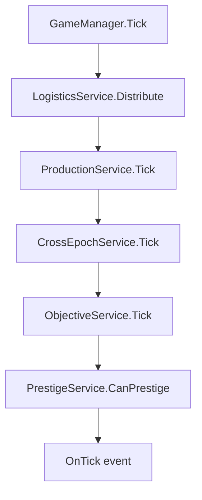

# Подробный План Релиза MVP 0.1

Основа плана: [docs/architecture/architecture-skeleton.md](docs/architecture/architecture-skeleton.md) и [docs/game-design/MVP 0.1.md](docs/game-design/MVP%200.1.md). Сейчас в `Assets/` нет C#-скриптов, поэтому сначала создаётся архитектурный фундамент, затем игровые системы, затем Unity-мост и UI. Unity `.asset`, `.prefab`, `.meta` файлы лучше создавать через Unity Editor, а код держать в пользовательских `.cs` файлах.

## Протокол Безопасности Для Unity-Generated Файлов

CursorAI не должен вручную создавать, редактировать или имитировать файлы, которые обычно создаёт Unity Editor, импортёр Unity или сборочная система. Это относится к `.meta`, `.asset`, `.prefab`, `.unity`, `.mat`, `.anim`, `.asmdef`, `Library/`, `Temp/`, `Logs/`, `ProjectSettings/`, `.csproj`, `.sln` и другим engine-managed или generated файлам.

Если шаг плана требует такой файл или настройку, AI должен остановиться и написать пользователю:

1. какой объект или файл нужно создать в Unity Editor;
2. где его создать и как назвать;
3. какие поля или ссылки выставить в Inspector;
4. какие файлы Unity, вероятно, сгенерирует сама;
5. какие действия AI сможет продолжить после того, как пользователь подтвердит создание.

После подтверждения пользователя AI продолжает только с безопасными пользовательскими текстовыми файлами: `.cs`, `.uxml`, `.uss`, `.md` и другой явно негенерируемой документацией или кодом.

## Релиз 0. Каркас Кода

Цель: подготовить структуру проекта, чтобы дальше разделять чистую логику, Unity-конфиги и UI.

1. Создать папки для кода, например:
   - `Assets/Scripts/Game/Core` — чистые C# модели, value types, сервисы, утилиты.
   - `Assets/Scripts/Game/Data` — `ScriptableObject`-definitions.
   - `Assets/Scripts/Game/Runtime` — `MonoBehaviour`-мосты, `GameManager`.
   - `Assets/Scripts/Game/UI` — UI Toolkit контроллеры.

2. Опционально создать assembly definitions:
   - `Game.Core` — без Unity-зависимостей, кроме случаев где нужен `Serializable`.
   - `Game.Data` — зависит от Unity и `Game.Core`.
   - `Game.Runtime` — зависит от `Game.Core` и `Game.Data`.
   - `Game.UI` — зависит от `Game.Runtime`, `Game.Data`, `Game.Core`.

   Важно: `.asmdef` считать assembly boundary / Unity-managed настройкой. Если они нужны, AI не пишет их вручную, а просит пользователя создать assembly definitions в Unity Editor с указанными именами и зависимостями.

3. Зафиксировать правило: вся экономика использует `GameNumber`; `float` используется только для времени, прогресс-баров и малых конфигурационных коэффициентов.

Готовность релиза: проект компилируется, есть структура для дальнейших классов, но игрового поведения ещё нет.

## Релиз 1. Базовые Числа И Value Types

Цель: реализовать типы, от которых зависит вся экономика.

1. Реализовать `GameNumber`.

`GameNumber` делает следующее:
- хранит все игровые величины ресурсов, стоимостей, скоростей, множителей, рабочих циклов и престижа;
- на MVP может быть обёрткой над `double`;
- поддерживает `Zero`, `One`, арифметику `+`, `-`, `*`, `/`, сравнения `>`, `<`, `>=`, `<=`, `==`;
- умеет безопасно конвертироваться из `double`;
- имеет методы форматирования/парсинга для JSON-строки вида `"1.23e5"`;
- позже может быть заменён внутри на `mantissa + exponent` без переписывания остальных классов.

2. Реализовать `ResourceAmount`.

`ResourceAmount` делает следующее:
- хранит `resourceId: string`;
- хранит `amount: GameNumber`;
- используется в рецептах, стоимостях, требованиях целей, отчётах оффлайн-прогресса.

3. Добавить первые unit-тесты на `GameNumber`.

Проверить:
- сложение, вычитание, умножение, деление;
- сравнение значений;
- `Zero` и `One`;
- сериализацию/десериализацию строки.

Готовность релиза: можно безопасно писать экономику, не используя `float`/`double` напрямую для игровых величин.

## Релиз 2. Data Layer: ScriptableObject Definitions

Цель: описать весь баланс и состав MVP как данные, но ещё без рантайм-логики.

1. Реализовать `ResourceDefinition : ScriptableObject`.

Класс делает следующее:
- описывает ресурс через `id`, `displayName`, `icon`, `tier`, `defaultStorageLimit`, `epochId`;
- различает `Base`, `Intermediate`, `Advanced`, `EpochOutput`;
- для `EpochOutput` фиксирует правило: ресурс не хранится в пуле эпохи, а уходит в `GameState.globalWorkCycles`.

2. Реализовать `RecipeDefinition : ScriptableObject`.

Класс делает следующее:
- хранит `inputs: List<ResourceAmount>`;
- хранит `outputs: List<ResourceAmount>`;
- хранит `cycleTime: float`;
- хранит `productionType: Continuous | Discrete`;
- описывает, что дискретный рецепт списывает входы в начале цикла и выдаёт выходы в конце.

3. Реализовать `BuildingDefinition : ScriptableObject`.

Класс делает следующее:
- описывает тип здания через `id`, `displayName`, `buildingType`, `epochId`;
- содержит ссылку на `RecipeDefinition`;
- хранит `baseProductionRate: GameNumber` для добывающих зданий;
- хранит `maxLevel`, `maxInstances`, стоимости строительства и апгрейда;
- хранит `upgradeCostFactor`, `productionGrowthFactor`, `workerSlots`, `workerEffectFactor`;
- хранит `internalBufferSize`, `defaultPriority`, `prefab`;
- поддерживает тип `CycleGenerator`, который производит рабочие циклы эпохи.

4. Реализовать `TechNodeDefinition : ScriptableObject` и `TechEffect`.

Класс делает следующее:
- описывает технологию через `id`, `displayName`, `description`, `epochId`, `cost`, `prerequisites`, `effects`;
- `TechEffect` поддерживает `UnlockBuilding`, `UnlockResource`, `UnlockEpoch`, `GlobalProductionBonus`, `CrossEpochBonus`, `IncreaseStorageLimit`, `UnlockCrossEpochChannel`, `IncreaseCycleOutput`.

5. Реализовать `EpochDefinition : ScriptableObject`.

Класс делает следующее:
- группирует ресурсы, здания и технологии одной эпохи;
- хранит `isUnlockedByDefault`;
- хранит `unlockRequirements`;
- хранит `epochCycleResourceId`, например `stone_age_cycle` или `industrial_cycle`.

6. Реализовать `CrossEpochLinkDefinition : ScriptableObject`.

Класс делает следующее:
- описывает канал передачи ресурса между эпохами;
- для MVP это канал `tools_export`: инструменты из Каменного века в Индустриальную эпоху;
- хранит скорость передачи, лимит буфера и технологию разблокировки.

7. Реализовать `GlobalGameConfig : ScriptableObject`.

Класс делает следующее:
- хранит `tickRate`, `autoSaveInterval`, `maxOfflineHours`, `offlineEfficiencyFactor`;
- хранит список эпох и межэпохных каналов;
- хранит параметры порога престижа.

8. Реализовать `FinalObjectiveDefinition : ScriptableObject` и `ObjectiveStageDefinition`.

Класс делает следующее:
- описывает финальную цель `Прототип пускового модуля`;
- хранит 4 этапа MVP;
- каждый этап проверяет ресурсы, технологии и при необходимости `requiredGlobalCycles`.

9. Через Unity Editor создать MVP-контент:
   - Каменный век: дерево, камень, доски, инструменты, рабочий цикл каменного века.
   - Каменный век здания: Лесоруб, Каменоломня, Мастерская, Перевалочный склад, Кузня циклов.
   - Индустриальная эпоха: руда, уголь, металл, машинные детали, промышленный рабочий цикл.
   - Индустриальные здания: Шахта, Плавильня, Сборочный цех, Логистический узел, Промышленный агрегатор.
   - Технологии: Обработка дерева, Каменные инструменты, Межэпохная доставка, Добыча руды, Плавка металла, Механизация добычи.
   - Межэпохный канал: инструменты из Каменного века в Индустриальную эпоху.
   - Кросс-эпохный бонус: `Механизация добычи` даёт Каменному веку `+15%` к добыче базовых ресурсов.

   Важно: этот пункт выполняется пользователем в Unity Editor. AI должен подготовить C#-типы и, при необходимости, чеклист полей для Inspector, но не должен вручную создавать `.asset` и `.meta` файлы.

Готовность релиза: весь MVP можно описать данными, но игра ещё не симулируется.

## Релиз 3. Runtime State: Чистое Состояние Игры

Цель: создать сериализуемое состояние без бизнес-логики.

1. Реализовать `ResourcePoolState`.

Класс делает следующее:
- хранит ресурсы эпохи в `amounts`;
- хранит лимиты в `storageLimits`;
- хранит кэши скоростей `incomingRatesCache` и `outgoingRatesCache` для UI;
- не хранит ресурсы `EpochOutput`.

2. Реализовать `BuildingState`.

Класс делает следующее:
- хранит состояние одного экземпляра здания;
- содержит `instanceId`, `definitionId`, `epochId`, `level`, `isActive`, `status`, `priority`;
- хранит рабочих, внутренний буфер, таймер цикла, прогресс цикла;
- хранит кэш `effectiveProductionRate` для UI.

3. Реализовать `EpochState`.

Класс делает следующее:
- хранит `epochId` и `isUnlocked`;
- содержит `ResourcePoolState`;
- содержит список построенных зданий;
- хранит разблокированные здания, ресурсы и технологии;
- хранит лимит рабочих, назначенных рабочих и множитель логистики.

4. Реализовать `CrossEpochChannelState`.

Класс делает следующее:
- хранит `linkId`, `isUnlocked`, `bufferAmount`, текущую скорость передачи и признак bottleneck.

5. Реализовать `FinalObjectiveState`.

Класс делает следующее:
- хранит текущий этап финальной цели;
- хранит произведённые ресурсы для этапа;
- хранит `isCompleted`.

6. Реализовать `OfflineReport`.

Класс делает следующее:
- описывает результат AFK-расчёта;
- хранит сколько ресурсов и рабочих циклов было получено;
- хранит признаки достижения лимитов и простоя.

7. Реализовать `PrestigeState`.

Класс делает следующее:
- хранит количество престижей;
- хранит очки престижа;
- хранит постоянные множители.

8. Реализовать `GameState`.

Класс делает следующее:
- является корневым объектом сохранения;
- хранит все `EpochState`;
- хранит межэпохные каналы;
- хранит глобальные множители;
- хранит `globalWorkCycles`, `workCyclesThisRun`, `epochCyclesContributed`;
- хранит `PrestigeState`, статистику произведённых ресурсов, финальную цель, timestamp сохранения и игровое время.

9. Реализовать фабрику нового состояния, например `GameStateFactory`.

Класс делает следующее:
- принимает `GlobalGameConfig`;
- создаёт `GameState` из ScriptableObject-конфигов;
- разблокирует Каменный век;
- создаёт стартовые лимиты хранения;
- создаёт пустые каналы;
- выставляет начальные глобальные множители в `1`.

Готовность релиза: можно создать новую игру в памяти и сериализовать её структуру, но производство ещё не идёт.

## Релиз 4. Утилиты И Балансные Формулы

Цель: вынести расчёты в небольшие проверяемые классы.

1. Реализовать `BalanceCalculator`.

Класс делает следующее:
- считает стоимость апгрейда;
- считает эффективную скорость производства;
- считает бонус рабочих;
- считает длительность цикла с учётом скорости;
- считает скорость передачи;
- считает порог престижа;
- считает награду престижа.

2. Реализовать `NumberFormatter`.

Класс делает следующее:
- форматирует `GameNumber` как `1.2K`, `4.5M`, `1.23e15`;
- форматирует скорость `+1.2K/с`;
- форматирует рабочие циклы;
- форматирует время и проценты для UI.

3. Реализовать `BottleneckDetector`.

Класс делает следующее:
- определяет нехватку ресурса;
- определяет переполнение склада;
- определяет перегруз логистики;
- определяет заполненный межэпохный канал;
- определяет простой CycleGenerator.

Готовность релиза: ключевые формулы покрыты тестами, сервисы смогут использовать единые расчёты.

## Релиз 5. MultiplierService

Цель: централизовать все множители до запуска производства.

1. Реализовать `MultiplierService`.

Класс делает следующее:
- считает `GetSpeedMultiplier(BuildingState, EpochState, GameState)`;
- считает `GetOutputMultiplier(BuildingState, EpochState, GameState)`;
- считает `GetCycleOutputMultiplier(BuildingState, EpochState, GameState)` для CycleGenerator;
- считает `GetEfficiencyMultiplier(BuildingState)`;
- учитывает рабочих, уровень здания, глобальные бонусы, кросс-эпохные бонусы и престиж;
- умеет инвалидировать кэш при апгрейде, изменении рабочих и исследовании технологий.

Готовность релиза: можно получить корректный множитель для любого здания, даже если производство ещё не тикает.

## Релиз 6. BuildingService: Строительство И Апгрейды

Цель: дать игроку первое управляемое действие над состоянием.

1. Реализовать `BuildingService`.

Класс делает следующее:
- `CanBuild` проверяет разблокировку здания, наличие ресурсов и лимит экземпляров;
- `Build` списывает стоимость и создаёт `BuildingState` первого уровня;
- `CanUpgrade` проверяет лимит уровня и ресурсы;
- `Upgrade` списывает стоимость и повышает уровень;
- `Toggle` включает и выключает здание;
- `SetPriority` меняет приоритет логистики;
- `AssignWorkers` назначает и снимает рабочих с проверкой слотов и общего лимита;
- `GetUpgradeCost` отдаёт текущую стоимость апгрейда.

2. Проверить базовый сценарий:
   - построить Лесоруба;
   - построить Каменоломню;
   - построить Мастерскую;
   - улучшить одно здание;
   - изменить приоритет.

Готовность релиза: состояние зданий меняется корректно, но автоматическое производство ещё не обязательно работает.

## Релиз 7. ProductionService: Производство Внутри Эпохи

Цель: запустить основной idle loop без логистики и межэпохных связей.

1. Реализовать `ProductionService`.

Класс делает следующее:
- обрабатывает один тик эпохи;
- пропускает неактивные здания;
- для `Extractor` начисляет ресурс плавно в общий пул;
- для `Producer` запускает дискретный цикл, списывает входы из internal buffer, обновляет таймер и выдаёт результат;
- для `CycleGenerator` работает как Producer, но на выходе увеличивает `globalWorkCycles`, `workCyclesThisRun` и `epochCyclesContributed`;
- не кладёт `EpochOutput` в пул эпохи;
- обновляет статусы зданий: `Active`, `WaitingForInput`, `WaitingForOutputSpace`, `Disabled`;
- пересчитывает `incomingRatesCache` и `outgoingRatesCache`.

2. Первый вертикальный срез Каменного века:
   - Лесоруб производит дерево;
   - Каменоломня производит камень;
   - Мастерская может производить доски или инструменты по рецепту;
   - Кузня циклов производит рабочие циклы из инструментов.

Готовность релиза: без UI можно увидеть рост ресурсов и `globalWorkCycles` в тесте или debug-инспекторе.

## Релиз 8. LogisticsService: Пул, Буферы И Приоритеты

Цель: сделать настоящую цепочку производства через общий пул и внутренние буферы зданий.

1. Реализовать `LogisticsService`.

Класс делает следующее:
- сортирует производственные здания по `priority` по убыванию;
- переносит ресурсы из пула эпохи во внутренние буферы зданий;
- уважает `internalBufferSize`;
- ограничивает передачу через `transferRate * deltaTime * logisticsMultiplier`;
- выставляет `WaitingForInput`, если ресурса не хватает;
- определяет bottleneck логистики, если суммарный спрос выше пропускной способности;
- обновляет `epochState.logisticsMultiplier` от логистических зданий.

2. Проверить bottleneck внутри эпохи:
   - Мастерская простаивает без камня или досок;
   - Кузня циклов простаивает без инструментов;
   - высокий приоритет одного здания действительно забирает ресурс первым.

Готовность релиза: Каменный век играет как мини-idle цепочка: добыча → переработка → инструменты → рабочие циклы.

## Релиз 9. TechService: Технологии И Разблокировки

Цель: добавить прогрессию, которая открывает здания, ресурсы, вторую эпоху и кросс-эпохные эффекты.

1. Реализовать `TechService`.

Класс делает следующее:
- `CanResearch` проверяет стоимость, prerequisites и доступность эпохи;
- `Research` списывает стоимость и добавляет технологию в исследованные;
- `ApplyEffect` применяет эффекты технологии к `GameState`.

2. Реализовать 6 технологий MVP:
   - `Обработка дерева` открывает переработку дерева в доски.
   - `Каменные инструменты` открывает производство инструментов и/или Кузню циклов.
   - `Межэпохная доставка` открывает канал экспорта инструментов.
   - `Добыча руды` открывает Индустриальную эпоху и базовую добычу руды/угля.
   - `Плавка металла` открывает металл и Сборочный цех.
   - `Механизация добычи` даёт Каменному веку `+15%` к добыче базовых ресурсов.

3. Проверить порядок прогрессии:
   - игрок начинает только с Каменного века;
   - инструменты появляются после ранних технологий;
   - экспорт инструментов появляется после `Межэпохная доставка`;
   - Индустриальная эпоха становится доступной после нужной технологии;
   - бонус от `Механизация добычи` реально меняет множитель добычи в Каменном веке.

Готовность релиза: игрок может открыть весь контент MVP через технологическую цепочку.

## Релиз 10. CrossEpochService: Межэпохный Канал

Цель: связать две эпохи ресурсным потоком.

1. Реализовать `CrossEpochService`.

Класс делает следующее:
- каждый тик обрабатывает активные каналы;
- забирает ресурс из `fromEpoch.resourcePool`;
- кладёт ресурс в буфер канала;
- выгружает ресурс из буфера в `toEpoch.resourcePool`;
- ограничивает передачу `currentTransferRatePerSecond` и `transferBufferLimit`;
- выставляет `isBottleneck`, если буфер заполнен;
- применяет числовые кросс-эпохные бонусы.

2. Реализовать MVP-канал:
   - `tools_export`: инструменты из Каменного века в Индустриальную эпоху.

3. Проверить индустриальную цепочку:
   - Шахта производит руду и уголь;
   - Плавильня делает металл;
   - Сборочный цех делает машинные детали из металла и инструментов;
   - Промышленный агрегатор делает промышленные рабочие циклы из машинных деталей.

Готовность релиза: вторая эпоха реально зависит от первой, а межэпохный bottleneck виден в состоянии канала.

## Релиз 11. ObjectiveService: Финальная Цель MVP

Цель: добавить достижимый конец первой версии.

1. Реализовать `ObjectiveService`.

Класс делает следующее:
- каждый тик проверяет текущий этап цели;
- проверяет `requiredResources` по `GameState.totalResourcesProduced`;
- проверяет `requiredTechIds`;
- проверяет `requiredGlobalCycles`;
- переводит цель на следующий этап;
- при последнем этапе выставляет `isCompleted = true`;
- вызывает финальное событие через `GameManager`.

2. Настроить 4 этапа:
   - стабильный поток инструментов в Каменном веке;
   - запуск экспорта инструментов в Индустриальную эпоху;
   - выпуск машинных деталей;
   - постройка `Прототипа пускового модуля`, требующая ресурсов обеих эпох и минимума `globalWorkCycles`.

Готовность релиза: у MVP есть завершение, которое проверяет обе эпохи, межэпохный канал и CycleGenerator.

## Релиз 12. PrestigeService: Заготовка Престижа

Цель: подготовить мета-прогресс, но не делать полноценное дерево улучшений.

1. Реализовать `PrestigeService`.

Класс делает следующее:
- `CanPrestige` проверяет `globalWorkCycles` против текущего порога;
- `CurrentPrestigeThreshold` считает порог через `prestigeThresholdBase * growthFactor ^ prestigeCount`;
- `GetPrestigeReward` показывает будущую награду;
- `ExecutePrestige` начисляет очки, увеличивает счётчик престижа и сбрасывает рантайм-часть игры;
- не сбрасывает `globalWorkCycles`, `prestige`, `totalResourcesProduced`.

2. В MVP заблокировать активное использование до завершения финальной цели.

Готовность релиза: после победы можно показать экран результата и запустить новый цикл, но без дерева глобальных улучшений.

## Релиз 13. SaveService И OfflineProgressService

Цель: сделать сессию устойчивой между запусками.

1. Реализовать `SaveService`.

Класс делает следующее:
- сериализует `GameState` в JSON;
- сохраняет в `PlayerPrefs` для MVP;
- загружает сохранение;
- возвращает `null`, если сохранения нет;
- удаляет сохранение для тестирования;
- сериализует `GameNumber` как строку.

2. Реализовать `OfflineProgressService`.

Класс делает следующее:
- считает время отсутствия игрока по `lastSaveTimestampUtc`;
- ограничивает его `maxOfflineHours`;
- применяет `offlineEfficiencyFactor`;
- для Extractor начисляет ресурс по скорости;
- для Producer считает упрощённое количество завершённых циклов;
- для CycleGenerator добавляет рабочие циклы в `globalWorkCycles` и отчёт;
- возвращает `OfflineReport`.

Готовность релиза: игру можно закрыть и открыть, состояние восстановится, а игрок получит простой AFK-отчёт.

## Релиз 14. GameManager: Точка Сборки И Tick Pipeline

Цель: связать состояние, сервисы, сохранение и Unity lifecycle.

1. Реализовать `GameManager : MonoBehaviour`.

Класс делает следующее:
- хранит ссылки на `GlobalGameConfig`, `EpochDefinition` и `FinalObjectiveDefinition`;
- создаёт сервисы;
- загружает `GameState` или создаёт новый через фабрику;
- применяет offline progress при старте;
- накапливает `Time.deltaTime`;
- вызывает игровой тик с частотой `tickRate`;
- автосохраняет игру;
- публикует события для UI.

2. Реализовать порядок тика строго так:

3. Реализовать proxy-методы для UI:
   - `RequestBuild`;
   - `RequestUpgrade`;
   - `RequestResearch`;
   - `RequestToggle`;
   - `RequestAssignWorkers`;
   - `RequestSetPriority`;
   - `RequestPrestige`.

Готовность релиза: игра симулируется целиком без финального UI, а состояние меняется только через `GameManager` и сервисы.

## Релиз 15. Минимальный UI Для Играбельности

Цель: дать игроку видеть ресурсы, здания, циклы и принимать решения.

1. Реализовать `ResourceHUDController`.

Класс делает следующее:
- показывает ресурсы эпохи;
- показывает количество, лимит и нетто-скорость;
- подсвечивает нехватку и переполнение;
- не показывает `EpochOutput`, потому что рабочие циклы идут в глобальную панель.

2. Реализовать `BuildingViewController`.

Класс делает следующее:
- показывает название, уровень, статус, прогресс цикла, рабочих и effective rate;
- вызывает upgrade/toggle/assign workers/priority через `GameManager`;
- показывает, почему здание стоит.

3. Реализовать `BuildShopPanelController`.

Класс делает следующее:
- показывает доступные здания;
- показывает количество построенных экземпляров и лимит;
- показывает стоимость строительства;
- отправляет команду строительства в `GameManager`.

4. Реализовать `EpochViewController`.

Класс делает следующее:
- объединяет HUD, список зданий и магазин строительства одной эпохи;
- обновляется по `OnTick` и `OnBuildingChanged`;
- пересоздаёт/обновляет view при строительстве.

5. Реализовать `GlobalCyclePanelController`.

Класс делает следующее:
- показывает `globalWorkCycles`;
- показывает `workCyclesThisRun`;
- показывает вклад каждой эпохи;
- показывает прогресс до порога престижа;
- активирует кнопку престижа только когда это разрешено.

Готовность релиза: можно играть в Каменный век, видеть bottleneck, строить, улучшать здания и видеть рост рабочих циклов.

## Релиз 16. UI Прогрессии И Межэпохной Связи

Цель: открыть полный MVP loop с двумя эпохами.

1. Реализовать `TechTreeController`.

Класс делает следующее:
- показывает узлы технологий;
- показывает состояния `Locked`, `Available`, `Researched`;
- отправляет команду исследования в `GameManager`;
- обновляет дерево после покупки технологии.

2. Реализовать `CrossEpochPanelController`.

Класс делает следующее:
- показывает буфер канала;
- показывает скорость передачи;
- показывает bottleneck межэпохного канала;
- показывает бонус второй эпохи к первой.

3. Реализовать `EpochSwitcherController`.

Класс делает следующее:
- показывает вкладки только разблокированных эпох;
- переключает активную эпоху;
- показывает новую вкладку после открытия Индустриальной эпохи.

Готовность релиза: игрок проходит от Каменного века до Индустриальной эпохи, запускает экспорт инструментов и видит влияние эпох друг на друга.

## Релиз 17. UI Финала, Оффлайна И Престижа

Цель: завершить MVP как полноценную короткую сессию.

1. Реализовать `ObjectivePanelController`.

Класс делает следующее:
- показывает текущий этап финальной цели;
- показывает требования по ресурсам, технологиям и рабочим циклам;
- показывает общий прогресс;
- реагирует на завершение цели.

2. Реализовать `OfflineReportController`.

Класс делает следующее:
- показывает время отсутствия;
- показывает полученные ресурсы;
- показывает полученные рабочие циклы;
- скрывается по кнопке продолжения.

3. Реализовать `PrestigeScreenController`.

Класс делает следующее:
- показывается после завершения финальной цели;
- показывает произведённые циклы;
- показывает очки престижа к получению;
- показывает общий баланс очков;
- запускает новый цикл через `GameManager.RequestPrestige`.

Готовность релиза: MVP имеет начало, прогрессию, финальную цель, экран победы и мягкий переход к следующему прогону.

## Релиз 18. Тесты, Баланс И Acceptance

Цель: довести MVP до состояния, где можно честно проверить дизайн-гипотезу.

1. Покрыть тестами чистую логику:
   - `GameNumber`;
   - `BalanceCalculator`;
   - `BuildingService`;
   - `ProductionService`;
   - `LogisticsService`;
   - `TechService`;
   - `CrossEpochService`;
   - `ObjectiveService`;
   - `PrestigeService`.

2. Проверить критерии MVP:
   - ресурсы генерируются автоматически;
   - здания потребляют и производят ресурсы;
   - есть лимиты хранения;
   - есть лимит межэпохной передачи;
   - есть bottleneck внутри эпохи;
   - есть bottleneck между эпохами;
   - игрок может строить и улучшать здания;
   - игрок понимает, почему производство остановилось;
   - обе эпохи имеют независимые цепочки;
   - экспорт инструментов влияет на Индустриальную эпоху;
   - `Механизация добычи` ускоряет Каменный век;
   - оба CycleGenerator производят рабочие циклы;
   - `globalWorkCycles` растёт и отображается;
   - финальная цель открывает экран престижа;
   - все игровые количества используют `GameNumber`.

3. Провести баланс-проход:
   - первый инструмент должен появляться быстро;
   - первый рабочий цикл должен быть достижим без долгого ожидания;
   - открытие Индустриальной эпохи должно ощущаться как вторая половина MVP, а не как отдельная игра;
   - финальная цель должна требовать работы обеих эпох;
   - bottleneck должен быть понятным по UI, а не только по числам.

## Рекомендуемые Вертикальные Срезы Для Релизов

Чтобы не ждать полного набора классов перед первой проверкой, лучше собирать MVP такими playable milestone:

1. `Core Economy Slice`: `GameNumber`, `ResourceAmount`, `ResourcePoolState`, базовые definitions, `GameStateFactory`.
2. `Stone Age Production Slice`: `BuildingService`, `ProductionService`, `LogisticsService`, Лесоруб, Каменоломня, Мастерская.
3. `Stone Cycle Slice`: Кузня циклов, `globalWorkCycles`, `GlobalCyclePanelController`.
4. `Tech Unlock Slice`: 6 технологий, открытие зданий, ресурсов и Индустриальной эпохи.
5. `Industrial Slice`: Шахта, Плавильня, Сборочный цех, Промышленный агрегатор.
6. `Cross Epoch Slice`: экспорт инструментов и `+15%` бонус от Механизации добычи.
7. `Goal Slice`: финальная цель из 4 этапов и экран престижа.
8. `Persistence Slice`: сохранение, загрузка и упрощённый offline progress.
9. `Polish Slice`: bottleneck UI, баланс, тесты, acceptance по документу MVP.

## Итоговый Порядок Классов

Если реализовывать строго по классам, порядок такой:

1. `GameNumber`
2. `ResourceAmount`
3. `ResourceDefinition`
4. `RecipeDefinition`
5. `BuildingDefinition`
6. `TechNodeDefinition` и `TechEffect`
7. `EpochDefinition`
8. `CrossEpochLinkDefinition`
9. `GlobalGameConfig`
10. `FinalObjectiveDefinition` и `ObjectiveStageDefinition`
11. `ResourcePoolState`
12. `BuildingState`
13. `EpochState`
14. `CrossEpochChannelState`
15. `FinalObjectiveState`
16. `OfflineReport`
17. `PrestigeState`
18. `GameState`
19. `GameStateFactory`
20. `BalanceCalculator`
21. `NumberFormatter`
22. `BottleneckDetector`
23. `MultiplierService`
24. `BuildingService`
25. `ProductionService`
26. `LogisticsService`
27. `TechService`
28. `CrossEpochService`
29. `ObjectiveService`
30. `PrestigeService`
31. `SaveService`
32. `OfflineProgressService`
33. `GameManager`
34. `ResourceHUDController`
35. `BuildingViewController`
36. `BuildShopPanelController`
37. `EpochViewController`
38. `GlobalCyclePanelController`
39. `TechTreeController`
40. `CrossEpochPanelController`
41. `EpochSwitcherController`
42. `ObjectivePanelController`
43. `OfflineReportController`
44. `PrestigeScreenController`