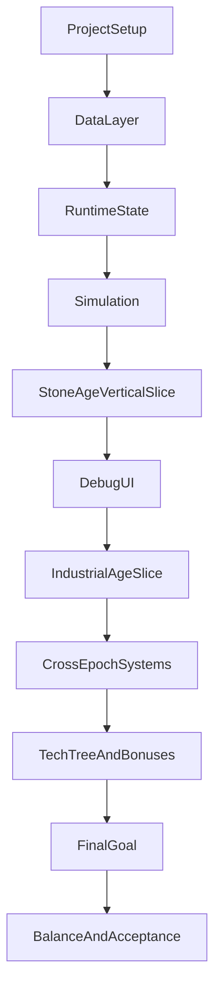

# План разработки MVP

Опора на документы:
- [architecture-skeleton.md](d:\Projects\gameMVPv2\docs\architecture\architecture-skeleton.md) — слои, структура `Assets/`, `asmdef`, Data/State/Simulation/Services/UI, стартовый backlog.
- [README.md](d:\Projects\gameMVPv2\docs\game-design\README.md) — навигация по дизайн-докам и указание, что для roadmap главным источником является `MVP 0.1.md` и `_compendium.md`.
- [MVP 0.1.md](d:\Projects\gameMVPv2\docs\game-design\MVP 0.1.md) — зафиксированный объём первой версии, контент двух эпох, межэпохная связь, критерии готовности.
- [_compendium.md](d:\Projects\gameMVPv2\docs\game-design\_compendium.md) — детали core loop, потоков ресурсов, логистики, приоритетов и требований к объяснимости симуляции.

Главный принцип декомпозиции: идти не по абстрактным «системам вообще», а по слоям и вертикальным срезам. Сначала сделать устойчивое ядро симуляции и одну играбельную эпоху, затем добавить вторую эпоху, затем межэпохные связи, затем цель сессии и полировку. Это соответствует архитектурной схеме из [architecture-skeleton.md](d:\Projects\gameMVPv2\docs\architecture\architecture-skeleton.md) и milestone из backlog Sprint 0, где после debug UI для первой эпохи предлагается только потом расширяться на вторую эпоху.

## Границы MVP

В план включено только то, что прямо поддерживает первую проверку геймплейной гипотезы из [MVP 0.1.md](d:\Projects\gameMVPv2\docs\game-design\MVP 0.1.md):
- 2 параллельные эпохи.
- По одной короткой производственной цепочке в каждой эпохе.
- Общий пул ресурсов внутри эпохи.
- Автораспределение ресурсов и приоритеты зданий.
- Апгрейды зданий.
- Минимальное дерево технологий.
- 1 межэпохный ресурсный канал.
- 1 числовой кросс-эпохный бонус.
- Короткая конечная цель: `Прототип пускового модуля`.

Сознательно не планируем на MVP:
- престиж;
- полный оффлайн-прогресс;
- глобальные улучшения;
- сложную логистику с маршрутами и развилками;
- глубокую систему рабочих;
- полный endgame с ракетой.

## Порядок реализации

### Этап 0. Подготовка проекта и технический каркас

Цель: привести проект к архитектурной базе, на которой дальше можно быстро наращивать игровые системы.

Что делать:
- Проверить и при необходимости подключить Addressables, потому что они зафиксированы в правилах проекта и в архитектурном скелете.
- Создать структуру папок `Assets/`, соответствующую [architecture-skeleton.md](d:\Projects\gameMVPv2\docs\architecture\architecture-skeleton.md).
- Создать `asmdef` для `Game.Runtime`, `Game.Infrastructure`, `Game.UI`, тестовых сборок.
- Подготовить базовую bootstrap-сцену и пустую игровую сцену.
- Зафиксировать базовые namespace и соглашения по именованию.

Результат этапа:
- проект компилируется;
- структура каталогов и сборок не требует переделки перед началом логики;
- есть точка входа для дальнейшей интеграции.

Как формулировать задачи мне:
- «Создай структуру папок и asmdef по архитектурному скелету».
- «Подготовь bootstrap scene и composition root без игровой логики».

### Этап 1. Базовые идентификаторы и Data Layer

Цель: собрать все типы данных, на которые будет опираться runtime и контент.

Что делать:
- Реализовать ID-типы: `ResourceId`, `EpochId`, `BuildingId`, `TechId`.
- Создать ScriptableObject definitions из Data Layer:
  - `GameConfig`;
  - `ResourceDefinition`;
  - `RecipeDefinition`;
  - `BuildingDefinition`;
  - `TechnologyDefinition`;
  - `EpochDefinition`;
  - `CrossEpochLinkDefinition`;
  - `GoalDefinition`.
- Заполнить только те поля, которые реально нужны для MVP 0.1, без задела на лишние метасистемы.
- Заложить поддержку двух типов межэпохной связи из [MVP 0.1.md](d:\Projects\gameMVPv2\docs\game-design\MVP 0.1.md): ресурсный канал и числовой бонус.

Результат этапа:
- runtime-логика может полностью опираться на definitions;
- контент эпох можно собирать как данные, а не хардкодить в коде.

Как формулировать задачи мне:
- «Реализуй ScriptableObject definitions для MVP без лишних полей».
- «Добавь ID-типы и свяжи их с definitions».

### Этап 2. Контентный минимум для Каменного века

Цель: сделать первую эпоху как автономный вертикальный срез.

Что делать:
- Создать definitions и asset-данные для эпохи 1:
  - ресурсы: дерево, камень, доски, инструменты;
  - здания: Лесоруб, Каменоломня, Мастерская, Перевалочный склад;
  - рецепты: `дерево -> доски`, `доски + камень -> инструменты`.
- Определить стартовые состояния: какие здания/рецепты доступны сразу.
- Задать лимиты хранения и простые балансные числа-заглушки для первого прогона.
- Подготовить конфиг эпохи так, чтобы её можно было крутить вообще без второй эпохи.

Результат этапа:
- эпоха 1 описана полностью на уровне данных и может стать первой тестовой песочницей.

Как формулировать задачи мне:
- «Создай MVP-контент StoneAge в ScriptableObject-данных».
- «Настрой минимальную цепочку до стабильного выпуска инструментов».

### Этап 3. State Layer

Цель: ввести чистое runtime-состояние, независимое от UI и сцены.

Что делать:
- Реализовать `ResourceLedger`.
- Реализовать `BuildingRuntimeState` со статусами работы и причинами простоя.
- Реализовать `EpochState`, `TechState`, `CrossEpochChannelState`, `GoalState`, корневой `GameState`.
- Продумать структуру так, чтобы состояния было удобно сериализовать и тестировать.
- Сразу поддержать поля, нужные для критериев MVP:
  - лимиты хранения;
  - idle reasons;
  - состояния канала передачи;
  - состояние открытия технологий и победной цели.

Результат этапа:
- появляется единый источник истины для симуляции и UI.

Как формулировать задачи мне:
- «Реализуй Runtime State для одной эпохи и добавь причины простоя зданий».
- «Добавь GameState и состояние межэпохного канала без UI».

### Этап 4. Базовая симуляция одной эпохи

Цель: запустить core loop Каменного века в чистом C#.

Что делать:
- Реализовать `EpochSimulator` по модели из [_compendium.md](d:\Projects\gameMVPv2\docs\game-design\_compendium.md): проверка входов, потребление, производство, накопление, применение лимитов.
- Реализовать порядок тика так, чтобы игрок всегда получал объяснимый результат: почему здание работает, простаивает или уткнулось в лимит.
- Реализовать `PriorityResolver` для распределения ресурсов между потребителями.
- Зафиксировать правило дефицита из `_compendium`: при нехватке ресурсов здание останавливается полностью, а не работает частично.
- Зафиксировать правило переполнения: при полном хранилище производство останавливается.

Результат этапа:
- первая эпоха сама генерирует, потребляет и преобразует ресурсы;
- появляются bottleneck и объяснимые idle reasons.

Как формулировать задачи мне:
- «Реализуй EpochSimulator для StoneAge с полным циклом потребление-производство-лимиты».
- «Добавь PriorityResolver и поведение зданий при дефиците/переполнении».

### Этап 5. Точечные тесты ядра

Цель: рано зафиксировать логику, на которой строится всё остальное.

Что делать:
- Добавить EditMode-тесты на `ResourceLedger`.
- Добавить EditMode-тесты на `EpochSimulator`.
- Добавить тесты на приоритеты потребления и причины простоя.
- Добавить тест на остановку производства при переполнении хранилища.

Результат этапа:
- ядро симуляции первой эпохи становится безопасной базой для наращивания второй эпохи.

Как формулировать задачи мне:
- «Покрой тестами ResourceLedger и EpochSimulator для MVP-сценариев».
- «Добавь тесты на idle reasons и распределение ресурсов по приоритетам».

### Этап 6. Infrastructure и игровой раннер

Цель: подключить чистое ядро к Unity-сцене и тикам приложения.

Что делать:
- Реализовать `GameBootstrap` как composition root.
- Реализовать `SimulationRunner`, который двигает симуляцию с фиксированным тиком из `GameConfig`.
- Связать загрузку definitions, создание `GameState` и вызов симуляции.
- Подготовить простую схему событий или обновления состояния для UI.

Результат этапа:
- проект можно реально запустить в Unity и увидеть, что первая эпоха тикает в игровом рантайме.

Как формулировать задачи мне:
- «Подключи Runtime к Unity через GameBootstrap и SimulationRunner».
- «Сделай рабочую точку входа для первой эпохи».

### Этап 7. Debug UI для первой эпохи

Цель: сделать симуляцию читаемой и подтвердить milestone из архитектурного скелета.

Что делать:
- На UI Toolkit собрать минимальный debug HUD.
- Показать список ресурсов и их количество/скорость.
- Показать здания, их статус, причину простоя и текущий рецепт.
- Показать лимиты хранения и факт переполнения.
- Дать игроку базовые действия: построить здание, улучшить здание, запустить/остановить нужную операцию, если это требуется текущей модели.

Результат этапа:
- выполнен milestone из [architecture-skeleton.md](d:\Projects\gameMVPv2\docs\architecture\architecture-skeleton.md): первая эпоха тикает и её состояние читаемо в интерфейсе.

Как формулировать задачи мне:
- «Сделай debug UI Toolkit HUD для первой эпохи».
- «Выведи ресурсы, здания и idle reasons без финальной вёрстки».

### Этап 8. Апгрейды зданий

Цель: дать игроку первый инструмент борьбы с bottleneck, кроме простого добавления новых зданий.

Что делать:
- Реализовать `BuildingUpgradeService`.
- Поддержать стоимость улучшения и рост параметров здания.
- Привязать апгрейды к runtime-state и UI.
- Проверить, что апгрейд реально меняет узкое место в первой эпохе.

Результат этапа:
- появляется второй управленческий рычаг, явно требуемый в [MVP 0.1.md](d:\Projects\gameMVPv2\docs\game-design\MVP 0.1.md).

Как формулировать задачи мне:
- «Реализуй апгрейды зданий и подключи их в UI».
- «Проверь, что апгрейды изменяют production bottleneck».

### Этап 9. Контентный минимум для Индустриальной эпохи

Цель: добавить вторую производственную зону как отдельный автономный слой.

Что делать:
- Создать definitions и assets для эпохи 2:
  - ресурсы: руда, уголь, металл, машинные детали;
  - здания: Шахта, Плавильня, Сборочный цех, Логистический узел;
  - рецепты: `руда + уголь -> металл`, `металл + инструменты -> машинные детали`.
- Подготовить стартовые параметры, чтобы эпоха 2 могла существовать в sandbox-режиме даже до подключения реального экспорта.
- Подключить отображение второй эпохи в runtime и UI.

Результат этапа:
- в проекте есть две независимые эпохи со своими цепочками.

Как формулировать задачи мне:
- «Добавь контент и конфиги IndustrialAge».
- «Подключи вторую эпоху к GameState и debug UI».

### Этап 10. Межэпохный ресурсный канал

Цель: реализовать первую прямую связь эпох, на которой держится гипотеза MVP.

Что делать:
- Реализовать `CrossEpochTransferSystem`.
- Поддержать канал передачи `инструментов` из Каменного века в Индустриальную эпоху.
- Ввести лимит межэпохной логистики как отдельное узкое место.
- Показать в UI: текущую передачу, упор в лимит, эффект на вторую эпоху.
- Сразу ограничиться одной связью и не проектировать общий сложный граф поставок.

Результат этапа:
- появляется один межэпохный bottleneck, который игрок может наблюдать и оптимизировать.

Как формулировать задачи мне:
- «Реализуй экспорт инструментов между эпохами с лимитом передачи».
- «Покажи в UI межэпохный bottleneck и состояние канала».

### Этап 11. Технологии и кросс-эпохный бонус

Цель: добавить прогрессию и вторую форму связи между эпохами.

Что делать:
- Реализовать `TechnologyService`.
- Добавить 6 технологий из [MVP 0.1.md](d:\Projects\gameMVPv2\docs\game-design\MVP 0.1.md).
- Поддержать как минимум три типа эффекта в рамках MVP:
  - unlock зданий/рецептов;
  - unlock межэпохного канала;
  - числовой бонус к добыче.
- Реализовать бонус `Механизация добычи`: `+15%` к базовой добыче первой эпохи после открытия технологии во второй эпохе.
- Показать бонус в UI как явный эффект второй эпохи на первую.

Результат этапа:
- игрок не просто строит фабрики, а открывает прогрессию и реально усиливает одну эпоху через другую.

Как формулировать задачи мне:
- «Реализуй минимальное дерево технологий для MVP».
- «Добавь кросс-эпохный бонус Механизация добычи и покажи его в интерфейсе».

### Этап 12. Финальная цель сессии

Цель: превратить экономическую песочницу в завершённый игровой цикл.

Что делать:
- Реализовать `GoalDefinition`, `GoalState`, `GoalService`.
- Добавить цель `Прототип пускового модуля`.
- Настроить её так, чтобы она требовала ресурсы из двух эпох и проверяла обе межэпохные связи.
- Встроить проверку победы в игровой цикл в явной точке после изменения состояния.
- Показать прогресс по цели в UI.

Результат этапа:
- у MVP появляется достижимый финал без престижа и мета-систем.

Как формулировать задачи мне:
- «Реализуй цель Прототип пускового модуля и состояние прогресса по ней».
- «Подключи победное условие и отображение прогресса в UI».

### Этап 13. UX-объяснимость и критерии приёмки

Цель: закрыть главные критерии успешности MVP, а не просто “чтобы оно работало”.

Что делать:
- Проверить, что игрок понимает, почему производство остановилось в любой типовой ситуации.
- Проверить, что есть хотя бы один bottleneck внутри эпохи и один между эпохами.
- Проверить, что экспорт инструментов действительно влияет на вторую эпоху.
- Проверить, что бонус `Механизация добычи` действительно ускоряет первую эпоху.
- Добавить недостающие UI-индикаторы и сообщения состояний, если симуляция уже работает, но плохо читается.
- Подправить баланс чисел так, чтобы путь до `Прототипа пускового модуля` занимал разумное время и демонстрировал обе эпохи.

Результат этапа:
- MVP соответствует критериям приёмки из [MVP 0.1.md](d:\Projects\gameMVPv2\docs\game-design\MVP 0.1.md), а не только технически существует.

Как формулировать задачи мне:
- «Проверь и доведи MVP до критериев готовности из документа».
- «Улучши объяснимость bottleneck и причин простоя в интерфейсе».

## Рекомендуемый порядок выдачи задач мне

Самый удобный способ работы с этим roadmap:
1. Давать один этап целиком, если он маленький.
2. Для крупных этапов дробить на 2–4 подзадачи: данные, runtime, UI, тесты.
3. Не смешивать в одном запросе новые игровые правила и полировку интерфейса, если это не один вертикальный срез.
4. Не начинать вторую эпоху, пока первая эпоха не тикает и не читается в debug UI.
5. Не начинать финальную цель, пока не работают обе межэпохные связи: канал и бонус.

## Практичная нарезка на будущие запросы

Ниже рекомендуемая последовательность конкретных запросов ко мне:
- Подготовить структуру проекта, `asmdef` и bootstrap.
- Реализовать Data Layer и ID-типы для MVP.
- Создать контент StoneAge в definitions/assets.
- Реализовать Runtime State.
- Реализовать симуляцию StoneAge.
- Добавить тесты на ядро симуляции.
- Подключить `GameBootstrap` и `SimulationRunner`.
- Сделать debug UI первой эпохи.
- Реализовать апгрейды зданий.
- Добавить данные и логику IndustrialAge.
- Реализовать межэпохный экспорт инструментов.
- Реализовать технологии и кросс-эпохный бонус.
- Реализовать `Прототип пускового модуля`.
- Провести доводку по критериям готовности MVP.

## Риски, которые надо держать под контролем

- Не разрастить MVP в сторону рабочих, сложной логистики и оффлайна раньше времени.
- Не зашить баланс и контент прямо в код, если архитектура уже рассчитана на definitions и данные.
- Не делать финальный UI раньше подтверждения, что core loop действительно читается и даёт bottleneck.
- Явно договориться внутри реализации, где применяется технологический бонус и в какой момент проверяется победа, чтобы логика не расползлась между симуляцией, сервисами и UI.

Этот план уже годится как рабочий roadmap. Следующим сообщением можно взять первый этап из списка «Практичная нарезка на будущие запросы» и начать реализацию без дополнительной декомпозиции.